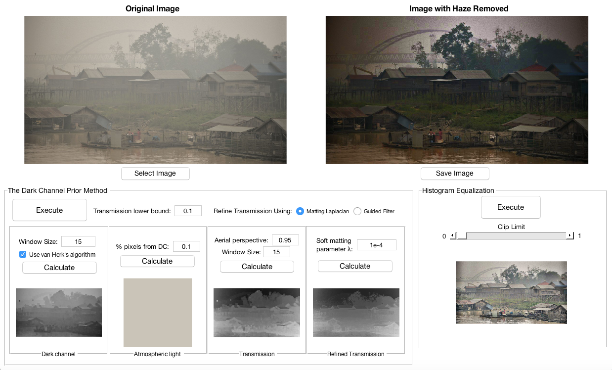

# Single Image Haze Removal using the Dark Channel Prior
This is a MATLAB implementation of the algorithm described in the paper by He et al. titled
"Single Image Haze Removal using Dark Channel Prior" [1]. It was completed as a term project for the EEE4512 Digital Image Processing course
at Bahcesehir University.

## Requirements
This program was designed such that a minimal amount of MATLAB toolboxes are required. The code and graphical user interface were tested on **MATLAB R2018a** (Version 9.4) and **GUIDE v2.5** respectively.

The following tools are required to run the program:
```
MATLAB
Image Processing Toolbox (To use Contrast-Limited Histogram Equalization in the GUI.)
```
You should still be able to use the GUI if you don't have the Image Processing Toolbox and don't plan on using Contrast-Limited Histogram Equalization.

## Execution
To dehaze an image, simply set the working directory to this folder and type the following into the MATLAB Command Window:
```
J = dehaze(I)
```
This function also takes in additional parameters which can be viewed in the file **'dehaze.m'**. Your image, 'I', must be in type *double*
and each pixel value must be between 0 and 1.

To use the Guided Filter [2] method instead of Soft Matting [3] to refine the transmission map, uncomment the necessary lines in **'dehaze.m'**.

### Graphical User Interface
The GUI allows each step of the dehazing process to be visualised. To open the GUI window add the folder called **'GUI'** to MATLAB path and run the following command:
```
remove_haze
```
Using the GUI window the parameters of the algorithm can be modified and the dehazed image can be saved to your computer.
Clicking on the images opens them in a larger window.

<div align="center"></div>

***Make sure to use the '.m' file to open the GUI, not the '.fig' file.***

## References

[1] K. He, J. Sun, and X. Tang, “Single image haze removal using dark channel prior," *IEEE transactions on pattern analysis and machine intelligence*, vol. 33, no. 12, pp. 2341–2353, 2011. <br>
[2] K. He, J. Sun, and X. Tang, “Guided image filtering,” in *European conference on computer vision*, pp. 1–14, Springer, 2010 <br>
[3] A. Levin, D. Lischinski, and Y. Weiss, “A closed form solution to natural image matting,” *Proceedings of the 2006 IEEE Computer Society Conference on Computer Vision and Pattern Recognition*, vol. 1, pp. 61–68, IEEE, 2006. <br>
[4] M.  van  Herk,  “A  fast  algorithm  for  local  minimum  and  maximum  filters  on  rectangular  and  octagonal  kernels,” *Pattern Recogn. Lett.*, vol. 13, pp. 517–521, July 1992.
